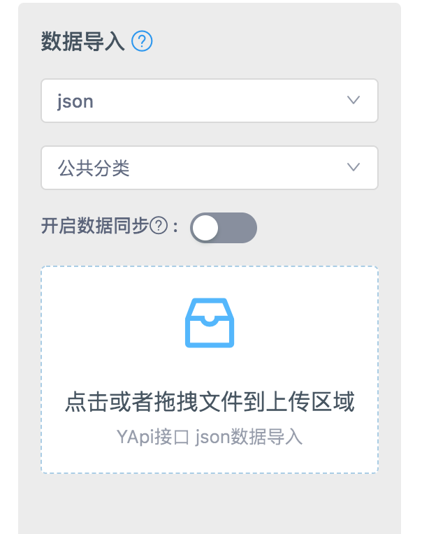

# 数据导入

在数据管理可快速导入其他格式的接口数据，方便快速添加接口。YApi 目前支持 postman, swagger, har 数据导入。

v1.3.23+ 增加数据导入的 3 种同步方式 normal, good, mergin

1. 普通模式(normal)：不导入已存在的接口；
2. 智能合并(good)：已存在的接口，将合并返回数据的 response，适用于导入了 swagger 数据，保留对数据结构的改动；例如，用户对字段 code 添加了 mock 信息, 当再次数据导入的时候 mock 字段将不会被覆盖
3. 完全覆盖(mergin)：不保留旧数据，完全使用新数据，适用于接口定义完全交给后端定义， 默认为 normal

## Postman 数据导入

1.首先在 postman 导出接口

<div></div>

2.选择 collection_v1,点击 export 导出接口到文件 xxx

<div></div>

3.打开 yapi 平台，进入到项目页面，点击数据管理，选择相应的分组和 postman 导入  方式， 选择刚才保存的文件路径，开始导入数据

<div></div>

## HAR 数据导入

<p>可用 chrome 实现录制接口数据的功能，方便开发者快速导入项目接口</p>

1.打开 Chrome 浏览器开发者工具，点击 network，首次使用请先 clear 所有请求信息，确保录制功能开启（红色为开启状态）

<div></div>

2.操作页面实际功能，完成后点击 save as HAR with content,将数据保存到文件 xxx

<div></div>

3.打开 yapi 平台，进入到项目页面，点击数据管理，选择相应的分组和 har 导入  方式， 选择刚才保存的文件路径，开始导入数据

<div></div>

> Tips: har 数据导入只支持 response.content.mimeType 为 application/json 类型的数据

## Swagger 数据导入

<p>什么是 Swagger ？</p>
<div>[Swagger从入门到精通](https://www.gitbook.com/book/huangwenchao/swagger/details)</div>

<br />
1.生成 JSON 语言编写的 Swagger API 文档文件<div>  例如这样的数据 （<a href="http://petstore.swagger.io/v2/swagger.json" target="blank">http://petstore.swagger.io/v2/swagger.json</a>），可以将其内容复制到 JSON 文件中。</div>
<br />

> Tips: v1.3.19 版本开始支持 swagger url 导入功能

2.打开 yapi 平台，进入到项目页面，点击数据管理，选择相应的分组和 swagger 导入  方式， 选择刚才的文件，开始导入数据

<div></div>

<div></div>

<div></div>

## YApi 接口 JSON 数据导入

该功能在 v1.3.12 版本上线，可导入在 yapi 平台导出的 json 接口数据。



## 通过命令行导入接口数据

YApi 支持通过命令行导入接口数据，他的应用场景是做自动化集成，比如配合 swagger ，接口文档前端不用维护，交由后端生成。

### 使用方法

第一步，确保 `yapi-cli >= 1.2.7` 版本，如果低于此版本请升级 `yapi-cli` 工具

```
npm install -g yapi-cli
```

第二步，在任意一个目录下新建配置文件 `yapi-import.json`，内容如下：

```json
{
  "type": "swagger",
  "token": "17fba0027f300248b804",
  "file": "swagger.json",
  "merge": "normal",
  "server": "http://yapi.local.qunar.com:3000"
}
```

`type` 是数据数据方式，目前官方只支持 swagger

`token` 是项目 token，在 `项目设置 -> token` 设置获取

`file` 是 swagger 接口文档文件，可使用绝对路径或 url

`merge` 有三种导入方式(v1.3.23+支持) normal, good, mergin

1. 普通模式(normal)：不导入已存在的接口；
2. 智能合并(good)：已存在的接口，将合并返回数据的 response，适用于导入了 swagger 数据，保留对数据结构的改动；
3. 完全覆盖(mergin)：不保留旧数据，完全使用新数据，适用于接口定义完全交给后端定义， 默认为 normal

`server` 是 yapi 服务器地址

第三步，在`新建配置文件的当前目录`，执行下面指令

```
yapi import
```
